  <picture>
    <source media="(prefers-color-scheme: dark)" srcset="assets/banner-dark.svg" />
    
  </picture>

<!-- ---------------------------------------------------------------------- -->

  
  
  
  

 

<!-- ═══════════════════  STATS  ═══════════════════ -->

  <a href="https://github.com/CoderSufiyan">
    <picture>
      <source media="(prefers-color-scheme: dark)" srcset="https://github-readme-stats.vercel.app/api?username=CoderSufiyan&show_icons=true&count_private=true&hide_border=true&theme=github_dark&title_color=3b82f6&icon_color=3b82f6&text_color=c9d1d9&bg_color=0d1117&ring_color=3b82f6&hide=stars" />
      
    </picture>
  </a>
  <a href="https://github.com/CoderSufiyan">
    <picture>
      <source media="(prefers-color-scheme: dark)" srcset="https://github-readme-stats.vercel.app/api/top-langs/?username=CoderSufiyan&layout=compact&hide_border=true&theme=github_dark&title_color=3b82f6&text_color=c9d1d9&bg_color=0d1117&langs_count=8" />
      
    </picture>
  </a>

<!-- ═══════════════════  SNAKE  ═══════════════════ -->

<picture>
  <source media="(prefers-color-scheme: dark)" srcset="https://raw.githubusercontent.com/CoderSufiyan/CoderSufiyan/output/snake-dark.svg" />
  <source media="(prefers-color-scheme: light)" srcset="https://raw.githubusercontent.com/CoderSufiyan/CoderSufiyan/output/snake.svg" />
  
</picture>

 

<!-- ═══════════════════  PROOF  ═══════════════════ -->

### ✦ Selected Outcomes

| Metric | Story |
|--------|-------|
| **1M+ req/min** | Highly-available distributed APIs handling production traffic at scale |
| **2 days → 4 hrs** | Slashed PR review turnaround by 92% with an LLM code-review agent |
| **70K+ users** | Zero-downtime React Native migration across the full mobile user base |
| **31 articles · 25.6K reads** | Published technical writing with ⭐ 4.78 average on Scaler Topics |
| **5 OSS packages** | Production-grade tools on npm & PyPI for MCP security, LLM reliability, and resilience |

---

### ⟠ Active Open Source

| Project | Contribution |
|--------|-------------|
| **[netbird](https://github.com/netbirdio/netbird)** _13K+ ★_ | WireGuard overlay network — fixed duplicate JWT group claims, guarded group deletion against active references, preserved user state through IdP sync cycles, corrected OpenAPI spec collisions, fixed Dex IdP template handling, added OIDC groups scope for generic providers. |
| **[cline](https://github.com/cline/cline)** | AI coding agent in IDE & terminal — configurable MCP init timeout, disabled bash in plan mode, token-budget error surfacing, persistent CLI settings, slash-command autocomplete for skills, draft preservation on mode toggle, LM Studio API key integration, telemetry & MCP server edge-case fixes — spanning the SDK, CLI, and VS Code extension. |

| Authored Package | Purpose | Quick Start |
|------------------|---------|-------------|
| [mcp-risk](https://github.com/CoderSufiyan/mcp-risk) | Scans MCP configs for risky tools, secrets & shell access | `npx mcp-risk scan` |
| [injection-guard](https://github.com/CoderSufiyan/injection-guard) | Prompt-injection detection & sanitization for LLM apps | `npm i injection-guard` |
| [llm-fallback](https://github.com/CoderSufiyan/llm-fallback) | Circuit-breaker fallback when model APIs fail | `npm i llm-fallback` |
| [envproof](https://github.com/CoderSufiyan/envproof) | Typed env-var validation with human-readable errors | `pip install envproof` |
| [backoffkit](https://github.com/CoderSufiyan/backoffkit) | Exponential backoff + jitter for sync & async Python | `pip install backoffkit` |

---

### ⚙ Experience

**Senior Software Engineer** — _2026 → Present_\
LLM code-review agent, distributed APIs (1M+ req/min), centralized audit logging, real-time monitoring. _LangChain · Node.js · AWS_

**Software Engineer** — _2024 → 2025_\
Async export pipeline with background processing, OTA mapping platform, shared React components. _React · MongoDB · GraphQL_

**Associate Software Engineer** — _2022 → 2023_\
React Native migration for 70K+ users, webhook event pipeline, biometric auth. 🏆 _App Development Pro Award_

---

### 🧠 Tech Stack

**Backend** — Node.js, Python, Express, GraphQL, PostgreSQL, MongoDB, Kafka\
**Frontend** — React, Next.js, React Native, TypeScript, Tailwind CSS\
**AI / Infra** — MCP, LangChain, OpenAI, Docker, AWS, Elasticsearch

---

### 📬 Let's Talk

I'm looking for **senior backend or full-stack roles** with real ownership — APIs, reliability, AI tooling, and systems that operate at scale. Best fit where product scope, platform thinking, and production rigor intersect.

  
  

---

  <i>Open to full-time · contract · consulting — remote, hybrid, or relocation</i>

